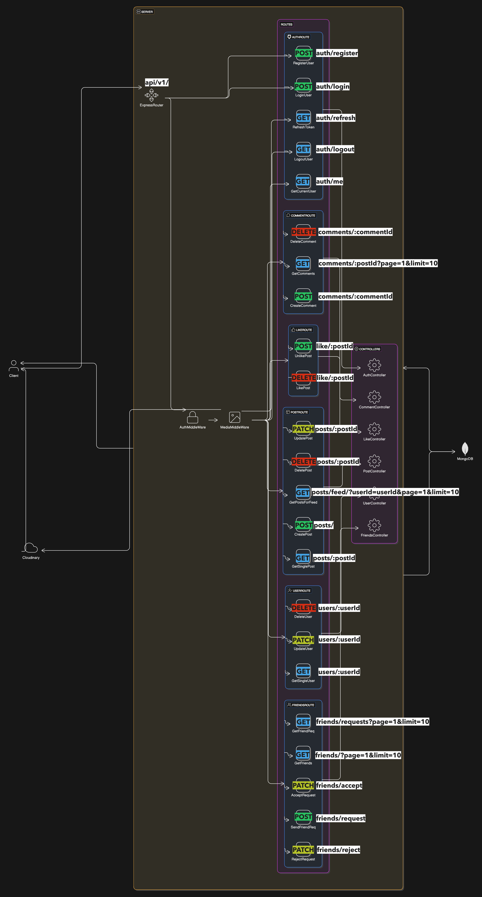

# API Design Document
by Anubhav Sharma
**email** - `anubhavsharma527@gmail.com`

## Table of Contents

1. [Overview](#overview)
2. [Goals](#goals)
3. [Requirements](#requirements)
4. [Features](#features)
5. [API Setup](#api-setup)
6. [API Endpoints](#api-endpoints)
   1. [Auth Route](#auth-route)
   2. [Post Route](#post-route)
   3. [User Route](#user-route)
   4. [Like Route](#like-route)
   5. [Comment Route](#comment-route)
   6. [Friend Route](#friend-route)


## Overview

- This document outlines the API design for a Content or posts feed system for social media app like Insta/FB.
- In this document, we will focus on the API endpoints and their functionality.
- This document focuses on high-level design but also contains some javascript code snippets for implementation as this was a javascript based question.



## Goals

The goal of this API is to provide a simple and efficient way for users to see and interact with posts created by their friends.

## Requirements

1. A user can see only those posts which were created by their friends.
2. A user can see posts of people who are not their friends, only if a friend has posted a comment on it.

## Features

1. Register user details.
2. Send/Receive and Accept/Reject friend request from users.
3. Create text-only posts along with comments and likes on their friend's posts.

## API Setup - Authentication and Authorization, Database Schema, Middleware, Error Handling

1. #### Database Schema

- We will be considering the Database schema given as a answer to question 1 for this api design.

2. #### Authentication and Authorization

- User authentication using JWT tokens, with refresh tokens for long-lived sessions.
- Data Validation and error handling.
- Hashing and salting user passwords for security.

3. #### Middleware and utilities

- Auth middleware for verifying JWT tokens.
- Multer middleware for handling file uploads.
- Error and Async handling utility for handling errors.
- Cloudinary utility for handling Pic uploads.
- API Response utility for consistent API responses.
- API Error utility for handling API errors.

**`Following is the code for Auth middleware which is used to verify requests coming from clients to the protected routes of the API and it also attaches the user object to the request object.`**
- ##### Javascript code snippet for Auth middleware
```js
export const verifyJWT = asyncHandler(async(req, _, next) => {
        try {
            //check for access token for both cookies and header
            const token = req.cookies?.accessToken || req.header("Authorization")?.replace("Bearer ", "")
            
            //if no token found
            if (!token) {
                throw new ApiError(401, "Unauthorized request")
            }

            //verify token
            const decodedToken = jwt.verify(token, process.env.ACCESS_TOKEN_SECRET)

            //find user
            const user = await User.findById(decodedToken?._id).select("-password -refreshToken")

            //if user not found
            if (!user) {
                
                throw new ApiError(401, "Invalid Access Token")
            }

            //attach user to request
            req.user = user;
            next()
        } catch (error) {
            throw new ApiError(401, error?.message || "Invalid access token")
        }
        
    })
``` 
- I won't be explaining the other middleware and utilities in detail here as they are self-explanatory and that's not the focus of this document.

## API Endpoints

1. ### Auth Route
   ## `api/v1/auth`
    #### 1.Register User
    - `api/v1/auth/register`
    - Method: POST
    - Description: Register a new user.
    - Request Body:
    ```json
    {
        "username": "username",
        "email": "email",
        "password": "password"
    }
    ```
    - Some JavaScript code snippets
    - `app.js`
    ```js
      app.use('/api/v1/auth', authRouter);
      ```
    - `auth.routes.js`
    ```js
    const router = require('express').Router();
    router.route('/register').post(authController.register);
    ```
    - `auth.controller.js`
    ```js
        const registerUser = asyncHandler( async (req, res) => {
    // get user details from frontend
    // validation - not empty
    // check if user already exists: username, email
    // create user object - create entry in db
    // remove password and refresh token field from response
    // check for user creation
    // return res


    const {userName, firstName, lastName, email, username, password } = req.body
    //console.log("email: ", email);

    if (
        [userName, firstName, lastName, email, username, password].some((field) => field?.trim() === "")
    ) {
        throw new ApiError(400, "All fields are required")
    }

    const existedUser = await User.findOne({
        $or: [{ username }, { email }]
    })

    if (existedUser) {
        throw new ApiError(409, "User with email or username already exists")
    }
    //console.log(req.files);
   

    const user = await User.create({
        firstName,
        lastName,
        email, 
        password,
        username: username.toLowerCase()
    })

    const createdUser = await User.findById(user._id).select(
        "-password -refreshToken"
    )

    if (!createdUser) {
        throw new ApiError(500, "Something went wrong while registering the user")
    }

    return res.status(201).json(
        new ApiResponse(200, createdUser, "User registered Successfully")
    )

    } )
    ```
    - Response:
    ```json
    {
        "statusCode": 200,
        "message": "User registered successfully",
        "data": {
            "userId": "userId",
            "username": "username",
            "email": "email",
        }
        "success": true
    }
    ```
    #### 2.Login User
    - `api/v1/auth/login`
    - Method: POST
    - Description: Login a user.
    - Request Body:
    ```json
    {
        "email": "email",//or username
        "password": "password"
    }
    ```
    - Some JavaScript code snippets
    - `auth.controller.js`
    ```js
    const loginUser = asyncHandler(async (req, res) =>{
    // req body -> data
    // username or email
    //find the user
    //password check
    //access and referesh token
    //send cookie

    const {email, username, password} = req.body
    console.log(email);

    if (!username && !email) {
        throw new ApiError(400, "username or email is required")
    }
    

    const user = await User.findOne({
        $or: [{username}, {email}]
    })

    if (!user) {
        throw new ApiError(404, "User does not exist")
    }

   const isPasswordValid = await user.isPasswordCorrect(password)

   if (!isPasswordValid) {
    throw new ApiError(401, "Invalid user credentials")
    }

   const {accessToken, refreshToken} = await generateAccessAndRefereshTokens(user._id)

    const loggedInUser = await User.findById(user._id).select("-password -refreshToken")

    const options = {
        httpOnly: true,
        secure: true
    }

    return res
    .status(200)
    .cookie("accessToken", accessToken, options)
    .cookie("refreshToken", refreshToken, options)
    .json(
        new ApiResponse(
            200,
            {
                user: loggedInUser, accessToken, refreshToken
            },
            "User logged In Successfully"
        )
    )

    })
    ```
    - Response: user details and tokens as JSON and HttpOnly cookies
    ```json
    {
        "statusCode": 200,
        "message": "User logged in successfully",
        "data": {
            "user": {
                "userId": "userId",
                "username": "username",
                "email": "email",
            }
            "refreshToken": "token",
            "accessToken": "token",
        }
        "success": true
    }
    ```
    #### 3.Logout User
    - `api/v1/auth/logout`
    - Method: POST
    - Description: Logout a user.
    - Request Body: None
    - JavaScript code snippets
    - `auth.controller.js`
    ```js
    const logoutUser = asyncHandler(async(req, res) => {
    await User.findByIdAndUpdate(
        req.user._id,
        {
            $unset: {
                refreshToken: 1 // this removes the field from document
            }
        },
        {
            new: true
        }
    )

    const options = {
        httpOnly: true,
        secure: true
    }

    return res
    .status(200)
    .clearCookie("accessToken", options)
    .clearCookie("refreshToken", options)
    .json(new ApiResponse(200, {}, "User logged Out"))
    })
    ```
    - Response: Success message
    ```json
    {
        "statusCode": 200,
        "message": "User logged out successfully",
        "success": true
    }
    ```

    #### 4.Get Current User
    - `api/v1/auth/me`
    - Method: GET
    - Description: Get current user details.
    - Request Body: None
    - JavaScript code snippets
    - `auth.controller.js`
    ```js
    const getCurrentUser = asyncHandler(async(req, res) => {
        return res
        .status(200)
        .json(new ApiResponse(
            200,
            req.user,
            "User fetched successfully"
        ))
    })
    ```
    - Response: user details as JSON
    ```json
    {
        "statusCode": 200,
        "message": "User details fetched successfully",
        "data": {
            "userId": "userId",
            "username": "username",
            "email": "email",
        }
        "success": true
    }
    ```
    #### 5.Refresh Token
    - `api/v1/auth/refresh`
    - Method: POST
    - Description: Refresh access token using refresh token.
    - Request Body: None
    - JavaScript code snippets
    - `auth.controller.js`
    ```js
    const refreshAccessToken = asyncHandler(async (req, res) => {
    const incomingRefreshToken = req.cookies.refreshToken || req.body.refreshToken

    if (!incomingRefreshToken) {
        throw new ApiError(401, "unauthorized request")
    }

    try {
        const decodedToken = jwt.verify(
            incomingRefreshToken,
            process.env.REFRESH_TOKEN_SECRET
        )
    
        const user = await User.findById(decodedToken?._id)
    
        if (!user) {
            throw new ApiError(401, "Invalid refresh token")
        }
    
        if (incomingRefreshToken !== user?.refreshToken) {
            throw new ApiError(401, "Refresh token is expired or used")
            
        }
    
        const options = {
            httpOnly: true,
            secure: true
        }
    
        const {accessToken, newRefreshToken} = await generateAccessAndRefereshTokens(user._id)
    
        return res
        .status(200)
        .cookie("accessToken", accessToken, options)
        .cookie("refreshToken", newRefreshToken, options)
        .json(
            new ApiResponse(
                200, 
                {accessToken, refreshToken: newRefreshToken},
                "Access token refreshed"
            )
        )
    } catch (error) {
        throw new ApiError(401, error?.message || "Invalid refresh token")
    }

    })
    ```
    - Response: New access token and HttpOnly cookie
    ```json
    {
        "statusCode": 200,
        "message": "Access token refreshed successfully",
        "data": {
            "accessToken": "token",
        }
        "success": true
    }
    ```

2. ### Post Route
   ## `api/v1/posts`
    #### 1.Create Post
    - `api/v1/posts`
    - Method: POST
    - Description: Create a new post.
    - Request Body:
    ```json
    {
        "userId": "userId",
        "content": "content",
    }
    ```
    - Javascript code snippets
    - `app.js`
    ```js
    app.use('/api/v1/posts', postRouter);
    ```
    - `post.routes.js`
    ```js
    const router = require('express').Router();
    router.route('/').post(postController.createPost);
    ```
    - `post.controller.js`
    ```js
    const createPost = asyncHandler( async (req, res) => {
    // get post details from frontend
    // validation - not empty
    // upload Pic to cloudinary
    // create post object - create entry in db
    // return res
    const {userId, content} = req.body

    const post = await Post.create({
        user: userId,
        content,
    })

    
    return res.status(201).ApiResponse(200, post, "Post created Successfully")
    } )
    ```
    - Response: post details as JSON
    - Example:
    ```json
    {
        "statusCode": 200,
        "message": "Post created successfully",
        "data": {
            "postId": "postId",
            "content": "text",
            "userId": "userId",
            "likeCount": 0,
            "commentCount": 0,
            "createdAt": "createdAt",
            "updatedAt": "updatedAt",
        }
        "success": true
    }
    ```
    #### 2.Get Posts for User feed
    - `api/v1/posts/feed/?userId=userId&page=1&limit=10`
    - Method: GET
    - Query Parameters: userId, page, limit
    - Description: Get posts for a user's feed.
    - Request Body: None
    - Javascript code snippets
    - `app.js`
    ```js
    app.use('/api/v1/posts', postRouter);
    ```
    - `post.routes.js`
    ```js
    const router = require('express').Router();
    router.route('/feed').get(postController.getPostsForUserFeed);
    ```
    - `post.controller.js`
    ```js
    const getPostsForUserFeed = asyncHandler( async (req, res) => {
    // get post details from frontend
    // validation - not empty
    // upload Pic to cloudinary
    // create post object - create entry in db
    // return res
    const {userId, page, limit} = req.query

    // Step 1: Fetch the list of user's friends
    const user = await User.findById(userId).select('friends');
    const friendsList = user.friends.map(friend => friend.toString());

    // Step 2: Fetch posts that satisfy either of the two conditions
    const feedPosts = await Post.find({
      $or: [
        // Condition 1: Posts created by user's friends
        { authorId: { $in: friendsList } },

        // Condition 2: Posts created by non-friends where a friend has commented
        {
          authorId: { $nin: friendsList, $ne: userId },
          _id: {
            $in: await Comment.distinct('postId', {
              authorId: { $in: friendsList }
            })
          }
        }
      ]
    }).sort({ createdAt: -1 }).skip((page - 1) * limit).limit(limit);

    return res.status(200).ApiResponse(200, feedPosts, "Posts fetched successfully")
    } )
    ```
    - Response: posts as JSON
    - Example:
    ```json
    {
        "statusCode": 200,
        "message": "Posts fetched successfully",
        "data": [
            {
                "postId": "12",
                "content": "text",
                "userId": "userId",
                "likeCount": 12,
                "commentCount": 2,
                "createdAt": "createdAt",
                "updatedAt": "updatedAt",
            },
            {
                "postId": "13",
                "content": "text",
                "userId": "userId",
                "likeCount": 20,
                "commentCount": 4,
                "createdAt": "createdAt",
                "updatedAt": "updatedAt",
            }
        ]
        "success": true
    }
    ```
    #### 3.Get a single Post
    - `api/v1/posts/:postId`
    - Method: GET
    - Description: Get a single post.
    - Request Body: None
    - Javascript code snippets
    - `post.controller.js`
    ```js
    const getPost = asyncHandler( async (req, res) => {
    // get post details from frontend
    // validation - not empty
    // upload Pic to cloudinary
    // create post object - create entry in db
    // return res
    const {postId} = req.params
    const post = await Post.findById(postId)

    return res.status(200).ApiResponse(200, post, "Post fetched successfully")
    } )
    ```

    - Response: post details as JSON
    - Example:
    ```json
    {
        "statusCode": 200,
        "message": "Post fetched successfully",
        "data": {
            "postId": "postId",
            "content": "text",
            "userId": "userId",
            "likeCount": 0,
            "commentCount": 0,
            "createdAt": "createdAt",
            "updatedAt": "updatedAt",
        }
        "success": true
    }
    ```

    #### 4.Update a Post
    - `api/v1/posts/:postId`
    - Method: PATCH
    - Description: Update a post.
    - Request Body:
    ```json
        "postId": "postId",
        "content": "text",
    ```
    - Javascript code snippets
    - `post.controller.js`
    ```js
    const updatePost = asyncHandler( async (req, res) => {
        const {postId} = req.params
        const {content} = req.body

        const post = await Post.findByIdandUpdate(postId, {
            content
        })

        return res.status(200).ApiResponse(200, post, "Post updated successfully")
    } )
    ```
    - Response: post details as JSON
    - Example:
    ```json
    {
        "statusCode": 200,
        "message": "Post updated successfully",
        "data": {
            "postId": "postId",
            "content": "text",
            "userId": "userId",
            "likeCount": 0,
            "commentCount": 0,
            "createdAt": "createdAt",
            "updatedAt": "updatedAt",
        }
        "success": true
    }
    ```

    #### 5.Delete a Post
    - `api/v1/posts/:postId`
    - Method: DELETE
    - Description: Delete a post.
    - Request Body: None
    - Javascript code snippets
    - `post.controller.js`
    ```js
    const deletePost = asyncHandler( async (req, res) => {
        const {postId} = req.params

        const post = await Post.findByIdandDelete(postId)

        return res.status(200).ApiResponse(200, post, "Post deleted successfully")
    })
    ```
    - Response: Success message
    - Example:
    ```json
    {
        "statusCode": 200,
        "message": "Post deleted successfully",
        "success": true
    }
    ```

3. ### User Route
   ## `api/v1/users`
    #### 1.Get a single User
    - `api/v1/users/:userId`
    - Method: GET
    - Description: Get a single user.
    - Request Body: None
    - Javascript code snippets
    - `user.controller.js`
    ```js
    const getUser = asyncHandler( async (req, res) => {
        const {userId} = req.params
        const user = await User.findById(userId).select('-password')
        return res.status(200).ApiResponse(200, user, "User fetched successfully")
    })
    ```
    - Response: user details as JSON
    - Example:
    ```json
    {
        "statusCode": 200,
        "message": "User fetched successfully",
        "data": {
            "userId": "userId",
            "username": "username",
            "email": "email",
            "firstName": "firstName",
            "lastName": "lastName",
            "profilePic": "profilePic",
            "coverPic": "coverPic",
            "bio": "bio",
            "createdAt": "createdAt",
            "updatedAt": "updatedAt",
        }
        "success": true
    }
    ```

    #### 2.Update a User
    - `api/v1/users/:userId`
    - Method: PATCH
    - Description: Update your profile.
    - Request Body:
    ```json
        "username": "username",
        "email": "email",
        "firstName": "firstName",
        "lastName": "lastName",
        "bio": "bio",
        "profilePic": "profilePicURL",
        "coverPic": "coverPicURL",
    ```
    - Javascript code snippets
    - `user.controller.js`
    ```js
    const updateUser = asyncHandler( async (req, res) => {
        const {userId} = req.params
        const {username, email, firstName, lastName, bio, profilePic, coverPic} = req.body

        //check if profilePic is uploaded
        const profilePicLocalPath = req.files?.profilePic[0]?.path;
        //const coverPicLocalPath = req.files?.coverPic[0]?.path;

        //check if cover Pic is uploaded
        let coverPicLocalPath;
        if (req.files && Array.isArray(req.files.coverPic) && req.files.coverPic.length > 0) {
            coverPicLocalPath = req.files.coverPic[0].path
        }
        
        //check if profilePic is uploaded
        if (!profilePicLocalPath) {
            throw new ApiError(400, "profilePic file is required")
        }

        //upload profilePic and cover Pic to cloudinary
        const profilePic = await uploadOnCloudinary(profilePicLocalPath)
        const coverPic = await uploadOnCloudinary(coverPicLocalPath)

        if (!profilePic) {
            throw new ApiError(400, "profilePic file is required")
        }

        const user = await User.findByIdandUpdate(userId, {
            username,
            email,
            firstName,
            lastName,
            bio,
            profilePic,
            coverPic
        })

        return res.status(200).ApiResponse(200, user, "User updated successfully")
    })
    ```
    - Response: user details as JSON
    - Example:
    ```json
    {
        "statusCode": 200,
        "message": "User updated successfully",
        "data": {
            "userId": "userId",
            "username": "username",
            "email": "email",
            "firstName": "firstName",
            "lastName": "lastName",
            "profilePic": "profilePic",
            "coverPic": "coverPic",
            "bio": "bio",
            "createdAt": "createdAt",
            "updatedAt": "updatedAt",
        }
        "success": true
    }
    ```

    #### 3.Delete a User
    - `api/v1/users/:userId`
    - Method: DELETE
    - Description: Delete your Account.
    - Request Body: None
    - Javascript code snippets
    - `user.controller.js`
    ```js
    const deleteUser = asyncHandler( async (req, res) => {
        const {userId} = req.params
        const user = await User.findByIdAndDelete(userId)
        return res.status(200).ApiResponse(200, user, "User deleted successfully")
    })
    ```
    - Response: Success message
    - Example:
    ```json
    {
        "statusCode": 200,
        "message": "User deleted successfully",
        "success": true
    }
    ```
4. ### Friend Route
   ## `api/v1/friends`
    #### 1.Send Friend Request
    - `api/v1/friends/request`
    - Method: POST
    - Description: Send a friend request.
    - Request Body:
    ```json
    {
        "receiverId": "receiverId"
        "status": "pending"
    }
    ```
    - Javascript code snippets
    - `friend.controller.js`
    ```js
    const sendFriendRequest = asyncHandler( async (req, res) => {
        const {userId} = req.user
        const {receiverId,status} = req.body

        const user = await friends.create({
            "user1": userId,
            "user2": receiverId,
            status
        })

        return res.status(200).ApiResponse(200, user, "Friend request sent successfully")
    })
    ```
    - Response: friend request details as JSON
    - Example:
    ```json
    {
        "statusCode": 200,
        "message": "Friend request sent successfully",
        "data": {
            "user1": "senderId",
            "user2": "receiverId",
            "status": "pending",
            "createdAt": "createdAt",
            "updatedAt": "updatedAt",
        }
        "success": true
    }
    ```

    #### 2.Accept Friend Request
    - `api/v1/friends/accept`
    - Method: POST
    - Description: Accept a friend request.
    - Request Body:
    ```json
        {
            "friendsId": "friendsId",
            "status": "accepted"
        }
    ```
    - Javascript code snippets
    - `friend.controller.js`
    ```js
    const acceptFriendRequest = asyncHandler( async (req, res) => {
        const {userId} = req.user
        const {requestId,status} = req.body

        const friends = await friends.findByIdandUpdate(friendsId, {
            status
        })


        return res.status(200).ApiResponse(200, friends, "Friend request accepted successfully")
    })
    ```
    - Response: friend request details as JSON
    - Example:
    ```json
    {
        "statusCode": 200,
        "message": "Friend request accepted successfully",
        "data": {
            "user1": "senderId",
            "user2": "receiverId",
            "status": "accepted",
            "createdAt": "createdAt",
            "updatedAt": "updatedAt",
        }
        "success": true
    }
    ```

    #### 3.Reject Friend Request
    - `api/v1/friends/reject`
    - Method: POST
    - Description: Reject a friend request.
    - Request Body:
    ```json
        {
            "friendsId": "friendsId"
            "status": "rejected"
        }
    ```
    - Javascript code snippets
    - `friend.controller.js`
    ```js
    const rejectFriendRequest = asyncHandler( async (req, res) => {
        const {userId} = req.user
        const {friendsId,status} = req.body

        const friends = await friends.findByIdandUpdate(friendsId, {
            status
        })

        return res.status(200).ApiResponse(200, request, "Friend request rejected successfully")
    })
    ```
    - Response: friend request details as JSON
    - Example:
    ```json
    {
        "statusCode": 200,
        "message": "Friend request rejected successfully",
        "data": {
            "user1": "senderId",
            "user2": "receiverId",
            "status": "rejected",
            "createdAt": "createdAt",
            "updatedAt": "updatedAt",
        }
        "success": true
    }
    ```

    #### 4.Get Friend Requests
    - `api/v1/friends/requests?page=1&limit=10`
    - Method: GET
    - Description: Get friend requests.
    - Request Body: None
    - Javascript code snippets
    - `friend.controller.js`
    ```js
    const getFriendRequests = asyncHandler( async (req, res) => {
        const {userId} = req.user
        const {page, limit} = req.query
        const requests = await User.find({$or: [{user1: userId}, {user2: userId}]}).skip((page - 1) * limit).limit(limit)

        return res.status(200).ApiResponse(200, requests, "Friend requests fetched successfully")
    })
    ```
    - Response: friend request details as JSON
    - Example:
    ```json
    {
        "statusCode": 200,
        "message": "Friend requests fetched successfully",
        "data": [
            {
                "user1": "senderId",
                "user2": "receiverId",
                "status": "pending",
                "createdAt": "createdAt",
                "updatedAt": "updatedAt",
            },
            {
                "user1": "senderId",
                "user2": "receiverId",
                "status": "accepted",
                "createdAt": "createdAt",
                "updatedAt": "updatedAt",
            }
        ],
        "success": true
    }
    ```


    #### 5.Get Friends
    - `api/v1/friends?page=1&limit=10`
    - Method: GET
    - Description: Get friends.
    - Request Body: None
    - Javascript code snippets
    - `friend.controller.js`
    ```js
    const getFriends = asyncHandler( async (req, res) => {
        const {userId} = req.user
        const {page, limit} = req.query
        
        const friends = await Friends.find({
            $or: [
            { user1: userId, status: 'accepted' },
            { user2: userId, status: 'accepted' }
            ]
        }).populate('user1 user2', 'firstName lastName profilePicture').skip((page - 1) * limit).limit(limit);


        return res.status(200).ApiResponse(200, friends, "Friends fetched successfully")
    })
    ```
    - Response: friend details as JSON
    - Example:
    ```json
    {
        "statusCode": 200,
        "message": "Friends fetched successfully",
        "data": {
            "name": "name",
            "email": "email",
            "profilePic": "profilePic",
            "friends": [
                {
                    "name": "name",
                    "email": "email",
                    "profilePic": "profilePic",
                },
                {
                    "name": "name",
                    "email": "email",
                    "profilePic": "profilePic",
                }
            ]
        }
        "success": true
    }
    ```

5. ### Comment Route
   ## `api/v1/comments`
    #### 1.Create Comment
    - `api/v1/comments`
    - Method: POST
    - Description: Create a new comment.
    - Request Body:
    ```json
    {
        "postId": "postId",
        "content": "text",
    }
    ```
    - Javascript code snippets
    - `comment.controller.js`
    ```js
    const createComment = asyncHandler( async (req, res) => {
        const {userId} = req.user
        const {postId,content,likeCount} = req.body

        const comment = await Comment.create({
            post: postId,
            user: userId,
            content,
        })

        await Post.findByIdAndUpdate(postId, {
            $inc: { commentCount: 1 }
        })

        return res.status(200).ApiResponse(200, comment, "Comment created successfully")
    })
    ```
    - Response: comment details as JSON
    - Example:
    ```json
    {
        "statusCode": 200,
        "message": "Comment created successfully",
        "data": {
            "_id": "id",
            "post": "postId",
            "user": "userId",
            "content": "text",
            "likeCount": 0
        }
        "success": true
    }
    ```

    #### 2.Get Comments for a Post
    - `api/v1/comments/:postId?page=1&limit=10`
    - Method: GET
    - Description: Get comments for a post.
    - Request Body: None
    - Javascript code snippets
    - `comment.controller.js`
    ```js
    const getCommentsForPost = asyncHandler( async (req, res) => {
        const {postId} = req.params
        const {page, limit} = req.query

        const comments = await Comment.find({post: postId}).skip((page - 1) * limit).limit(limit)

        return res.status(200).ApiResponse(200, comments, "Comments fetched successfully").sort({createdAt: -1})
    })
    ```

    - Response: comments as JSON
    - Example:
    ```json
    {
        "statusCode": 200,
        "message": "Comments fetched successfully",
        "data": [
            {
                "_id": "id",
                "post": "postId",
                "user": "userId",
                "content": "text",
                "likeCount": 0
            },
            {
                "_id": "id",
                "post": "postId",
                "user": "userId",
                "content": "text",
                "likeCount": 0
            }
        ]
        "success": true
    }
    ```
    #### 3.Delete a Comment
    - `api/v1/comments/:commentId`
    - Method: DELETE
    - Description: Delete a comment.
    - Request Body: None
    - Javascript code snippets
    - `comment.controller.js`
    ```js
    const deleteComment = asyncHandler( async (req, res) => {
        const {commentId} = req.params

        const comment = await Comment.findByIdandDelete(commentId)

        await Post.findByIdAndUpdate(comment.post, {
            $inc: { commentCount: -1 }
        })

        return res.status(200).ApiResponse(200, comment, "Comment deleted successfully")
    })
    ```
    - Response: Success message
    - Example:
    ```json
    {
        "statusCode": 200,
        "message": "Comment deleted successfully",
        "success": true
    }
    ```

6. ### Like Route
   ## `api/v1/likes`
    #### 1.Like a Post
    - `api/v1/likes/:postId`
    - Method: POST
    - Description: Like a post.
    - Request Body: None
    - Javascript code snippets
    - `like.controller.js`
    ```js
    const likePost = asyncHandler( async (req, res) => {
        const {userId} = req.user
        const {postId} = req.params

        const like = await Like.create({
            user: userId,
            post: postId
        })

        await Post.findByIdAndUpdate(postId, {
            $inc: { likeCount: 1 }
        })

        return res.status(200).ApiResponse(200, like, "Post liked successfully")
    })
    ```
    - Response: like details as JSON
    - Example:
    ```json
    {
        "statusCode": 200,
        "message": "Post liked successfully",
        "data": {
            "_id": "id",
            "user": "userId",
            "post": "postId"
            "createdAt": "createdAt",
        }
        "success": true
    }
    ```

    #### 2.Unlike a Post
    - `api/v1/likes/:postId`
    - Method: DELETE
    - Description: Unlike a post.
    - Request Body: None
    - Javascript code snippets
    - `like.controller.js`
    ```js
    const unlikePost = asyncHandler( async (req, res) => {
        const {userId} = req.user
        const {postId} = req.params

        const like = await Like.findOneAndDelete({
            user: userId,
            post: postId
        })

        await Post.findByIdAndUpdate(postId, {
            $inc: { likeCount: -1 }
        })

        return res.status(200).ApiResponse(200, like, "Post unliked successfully")
    })
    ```
    - Response: Success message
    - Example:
    ```json
    {
        "statusCode": 200,
        "message": "Post unliked successfully",
        "success": true
    }
    ```
